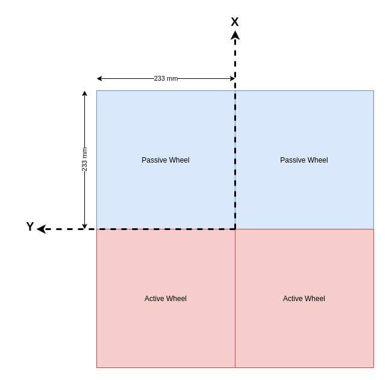

# robile_description

Robot description for the KELO robile's in form of URDF files and meshes

## Available KELO ROBILE modules

The following robile modules are made available as [xacro macro](http://wiki.ros.org/xacro#Macros)'s. To reduce the computational load during simulation and to protect proprietary design, the meshes provided in this package are an approximation of the real hardware. The modules are defined in the [robile_modules](urdf/robile_modules/) directory.

| ROBILE module         | Purpose                                                                                                                             |
|-----------------------|-------------------------------------------------------------------------------------------------------------------------------------|
| robile_active_wheel   | A robile module with an [active KELO Drive](https://www.shop.kelo-robotics.com/product-page/active-wheel) attached to it.           |
| robile_passive_wheel  | A robile module with a [passive caster wheel](https://www.shop.kelo-robotics.com/product-page/passive-caster-wheel) attached to it. |
| robile_master_battery | A mockup of a robile module with a [master battery](https://www.shop.kelo-robotics.com/product-page/onboard-cpu)                    |
| robile_cpu            | A mockup of a robile with an [onboard CPU](https://www.shop.kelo-robotics.com/product-page/onboard-cpu)                             |
| robile_empty          | A mockup of a full-sized [empty robile module](https://www.shop.kelo-robotics.com/product-page/full-sized-empty-brick)              |

## Building a custom ROBILE platform configuration

The above ROBILE modules can be used to construct customized platform's. We describe the procedure to build a new platform with a simple example. Lets assume we want to build a new platform with the name `simple_config`. This platform consists of two active wheels and two passive wheels. For simplicity, lets assume we do not include any CPU or master_battery bricks in the platform.

### Step-1: Define a new robot
1. Since we want to name our platform `simple_config`, we create a file `simple_config.urdf.xacro` in the [robots/](robots/) directory.
2. We then add the following block of code to define the new robot platform
    ~~~ xml
    <?xml version='1.0'?>
    <robot xmlns:xacro="http://ros.org/wiki/xacro" name="simple_config" >

        <!-- Include desired robile modules -->
        <xacro:include filename="$(find robile_description)/urdf/robile_modules/robile_active_wheel.urdf.xacro" />
        <xacro:include filename="$(find robile_description)/urdf/robile_modules/robile_passive_wheel.urdf.xacro" />

        <link name="base_link"/>

    </robot>
    ~~~
    Since our platform will only consists of active and passive robile modules, we only include the `robile_active_wheel` and `robile_passive_wheel` xacro files.

### Step-2: Add ROBILE modules to the new robot
Let's assume we want our platform to have the following arrangement of the ROBILE modules where the front two modules are passive wheels and the rear two modules are active wheels.   

We shall use the center of the robot as the base_link and hence, as shown in the figure, each robile module center will be at `+/- 0.1165m` from the base_link, depending on the position of each module.

Therefore we instantiate the robile modules as follows. We can use arbitrary names for each robile module, but in this example, we name each module as `robile_'n'`. The origin for each robile module is specified w.r.t. the `base_link`.

~~~ xml
<xacro:robile_passive_wheel name="robile_1" parent="base_link">
    <origin xyz="0.1165 0.1165 0.05" rpy="0.0 0.0 0.0"/>
</xacro:robile_passive_wheel>

<xacro:robile_passive_wheel name="robile_2" parent="base_link">
    <origin xyz="0.1165 -0.1165 0.05" rpy="0.0 0.0 0.0"/>
</xacro:robile_passive_wheel>

<xacro:robile_active_wheel name="robile_5" parent="base_link">
    <origin xyz="-0.1165 -0.1165 0.05" rpy="0.0 0.0 0.0"/>
</xacro:robile_active_wheel>

<xacro:robile_active_wheel name="robile_6" parent="base_link">
    <origin xyz="-0.1165 0.1165 0.05" rpy="0.0 0.0 0.0"/>
</xacro:robile_active_wheel>
~~~

The complete file would look as follows:

~~~ xml
<?xml version='1.0'?>
<robot xmlns:xacro="http://ros.org/wiki/xacro" name="simple_config" >

    <!-- Include desired robile modules -->
    <xacro:include filename="$(find robile_description)/urdf/robile_modules/robile_active_wheel.urdf.xacro" />
    <xacro:include filename="$(find robile_description)/urdf/robile_modules/robile_passive_wheel.urdf.xacro" />

    <link name="base_link"/>

    <xacro:robile_passive_wheel name="robile_1" parent="base_link">
        <origin xyz="0.1165 0.1165 0.05" rpy="0.0 0.0 0.0"/>
    </xacro:robile_passive_wheel>

    <xacro:robile_passive_wheel name="robile_2" parent="base_link">
        <origin xyz="0.1165 -0.1165 0.05" rpy="0.0 0.0 0.0"/>
    </xacro:robile_passive_wheel>

    <xacro:robile_active_wheel name="robile_5" parent="base_link">
        <origin xyz="-0.1165 -0.1165 0.05" rpy="0.0 0.0 0.0"/>
    </xacro:robile_active_wheel>

    <xacro:robile_active_wheel name="robile_6" parent="base_link">
        <origin xyz="-0.1165 0.1165 0.05" rpy="0.0 0.0 0.0"/>
    </xacro:robile_active_wheel>

</robot>
~~~
